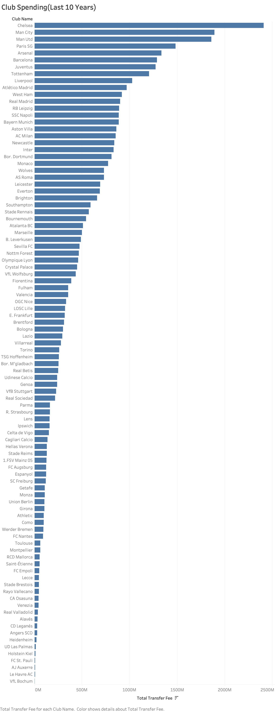
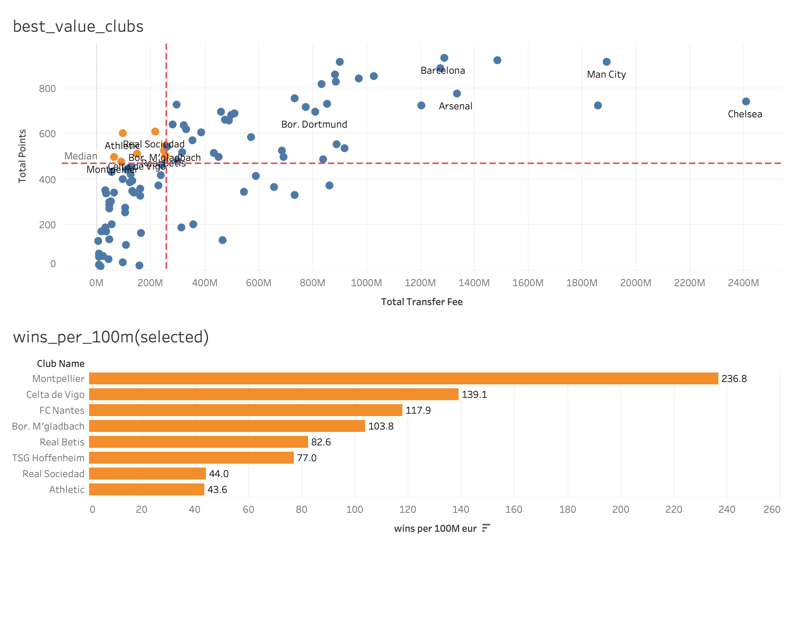
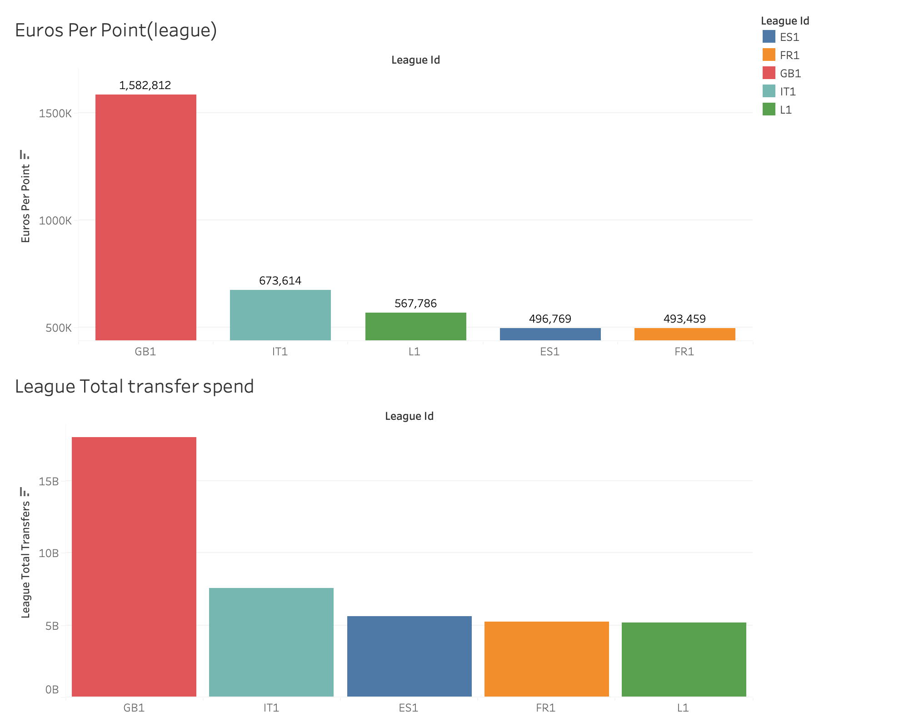
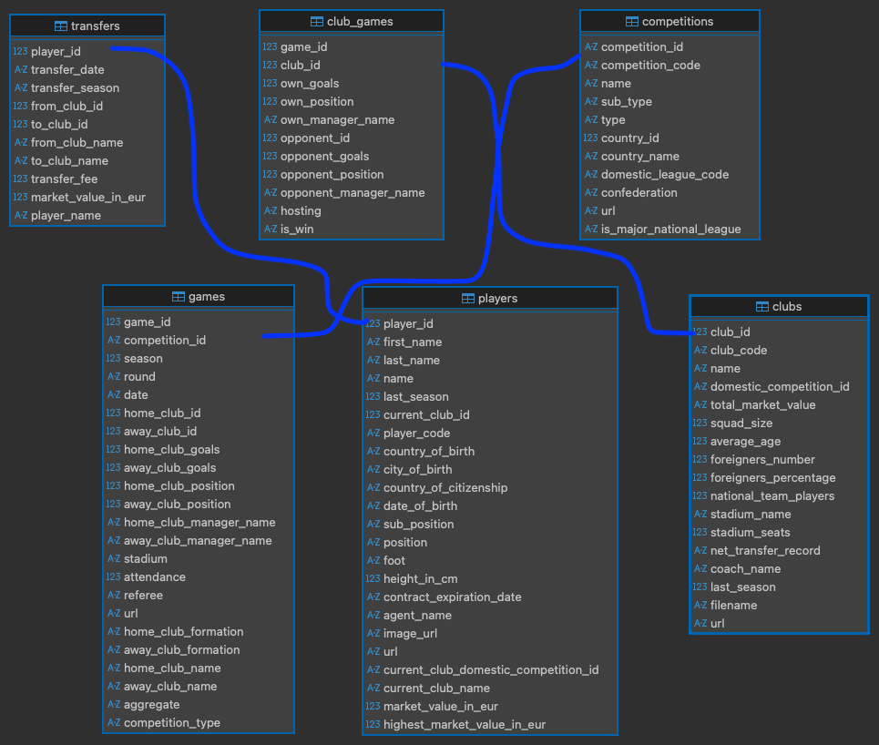

# Football Investment Efficiency Analysis  
### Top 5 European Leagues (2014–2024)

---

## Client Background

A Middle Eastern sovereign investment group is exploring the acquisition of a European football club as part of a long-term global sports, media, and entertainment investment strategy.

While elite clubs command premium valuations, historical evidence suggests that financial dominance does not always translate into proportional on-pitch success. The client’s objective is not only to acquire a prestigious asset, but to identify clubs and leagues that consistently convert financial investment into competitive performance.

This project evaluates football performance through the lens of capital efficiency, treating clubs as investment vehicles rather than purely sporting institutions.

---

## North Star Metrics

To align sporting outcomes with business objectives, this analysis prioritizes efficiency-based KPIs rather than raw spending or brand prestige.

### Performance Metrics
- **Total Points (2014–2024)** — Long-term competitive success  
- **Total Wins** — Match-level consistency  
- **Goal Difference** — Tactical dominance beyond wins alone  

### Financial Metrics
- **Total Transfer Expenditure (2014–2024)** — Capital invested in squad building  
- **Total Squad Market Value (2024 snapshot)** — Proxy for current asset valuation  

### Efficiency Metrics (Core KPIs)
- **Wins per €100M Squad Value**  
- **Points per €100M Squad Value**  
- **€ Spent per League Point**  

These metrics enable fair comparisons across clubs and leagues operating at vastly different financial scales.

---

## Executive Dashboards

The dashboards are designed for board-level decision making, translating complex football and financial data into actionable investment insights.

---

### Market Overview: Cost of Competing in European Football

This visualization provides context on the financial landscape of elite European football.  
It highlights cumulative club spending over the analysis period and illustrates the disparity in capital requirements across leagues.

**Purpose:** Establish baseline entry costs before evaluating performance efficiency.

---

### Club Investment Efficiency: Best Value Clubs

This dashboard identifies clubs that maximize on-field performance relative to financial resources.  
It highlights clubs delivering strong points and wins while maintaining superior efficiency per €100M invested.

**Insight:** These clubs represent potential acquisition targets or candidates for deeper due diligence due to their ability to outperform financially stronger competitors.

---

### League-Level Investment Efficiency

This dashboard evaluates macro-level efficiency across Europe’s top leagues by aggregating performance and financial investment at the league level.

It enables direct comparison of:
- Total league spend  
- Total league points  
- € spent per league point  

**Insight:** Leagues with lower € spent per point demonstrate stronger structural efficiency and may offer more attractive environments for long-term investment.

---

## Executive Dashboard Analysis & Financial Recommendation

### Market Context

Club spending across Europe is highly skewed. A small group of elite clubs account for a disproportionate share of total transfer expenditure, while the majority of clubs operate with significantly lower capital outlay.

Entry into the top spending tier requires sustained investment exceeding €1.5–2.0B over a decade. Below this tier, competitive participation remains viable at a fraction of the cost.

**Implication:** Top-tier clubs resemble high-cost, low-efficiency assets with diminishing marginal returns.

---

### Club-Level Efficiency Insights

The best-value analysis highlights several clubs operating in the low-spend, high-performance quadrant. These clubs consistently generate competitive outcomes while maintaining disciplined financial profiles.

High-spend clubs achieve strong results but often at poor efficiency ratios. In contrast, mid-market clubs demonstrate superior return on investment when performance is normalized by capital deployed.

**Implication:** The most attractive acquisition targets are not the highest-performing clubs, but those that deliver above-median performance with below-median spending.

---

### League-Level Efficiency Insights

League aggregation reveals meaningful structural differences:

- The Premier League exhibits the highest total spend but the weakest efficiency in euros per point.
- La Liga and Ligue 1 demonstrate the strongest capital efficiency despite lower global revenue.
- The Bundesliga and Serie A balance moderate spend with relatively strong efficiency and governance structures.

**Implication:** League selection materially impacts long-term investment returns, independent of club quality.

---

### Financial Recommendation

**Recommended Strategy:**  
Target a mid-table club in La Liga, Ligue 1, or the Bundesliga with sustained efficiency rather than short-term overperformance.

**Rationale:**
- Lower acquisition and operating costs  
- Higher marginal return per euro spent  
- Reduced exposure to wage inflation  
- Greater upside through player development and trading  
- Clear pathway to asset appreciation without elite-level spending  

**Not Recommended:**
- Acquiring Premier League clubs purely for performance efficiency  
- Overpaying for historically successful but financially inefficient clubs  
- Targeting unstable clubs based solely on short-term efficiency metrics  

---

## Data Structure

All analysis is performed using SQL on a normalized football database.

### Key Tables
- **games** — Match results, goals, seasons, competitions  
- **clubs** — Club metadata and domestic league classification  
- **players** — Player market values and club affiliation  
- **transfers** — Transfer fees and transaction dates  

### Database Schema

The following diagram illustrates the relationships between tables, primary keys, and foreign keys:

### Scope
- **Leagues:** Premier League (GB1), La Liga (ES1), Serie A (IT1), Bundesliga (L1), Ligue 1 (FR1)  
- **Timeframe:** 2014–2024  
- **Currency:** EUR  

---

## Analytical Questions

1. Do higher-spending clubs perform better?  
2. Which clubs outperform their financial resources?  
3. Which league is the most financially efficient?  

---

## Business Relevance

- Football clubs are capital-intensive assets  
- Performance drives media revenue, sponsorships, and valuation  
- Efficient capital allocation supports long-term asset appreciation  

This analysis reframes football performance as a return-on-investment problem, aligning sporting outcomes with financial discipline.

---

## Tools and Skills Demonstrated

- Advanced SQL (CTEs, UNION ALL, subqueries, aggregation)  
- KPI design and efficiency modeling  
- Financial-performance analysis  
- Executive-level data storytelling  

---

## SQL Scripts

All SQL queries used in this analysis are available on GitHub.  
These scripts include all data preparation, aggregation, and efficiency calculations used for this project.

📂 [View and download SQL scripts on GitHub](https://github.com/noyizthehawk/Soccer_analytics_portfolio/tree/main/sql)

